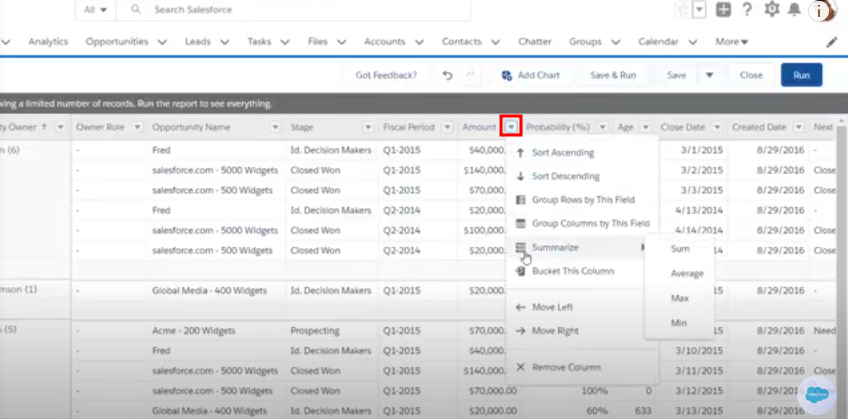

3. [Salesforce Basic Report](salesforce.md): This is a step-by-step guide to walk users through the process of creating a basic report in Salesforce. Images are low resolution as they pulled directly from [YouTube](https://www.youtube.com/watch?v=FprCnEnz07U) (Salesforce didn't provide a free trial, and their support team didn't help). Dummy links are used in the *Next Steps* section. Table of Contents hasn't been added, as it requires minor tweaks to the mdbook code to display it as a right-panel, typical of modern user-guides.

# How to Create a Basic Report in Salesforce
---
Salesforce provides a powerful reporting feature that allows users to create customised reports based on their data. Whether you're a beginner or have some experience with Salesforce, this step-by-step guide will walk you through the process of creating a basic report.

> #### Prerequisites
>- A Salesforce account with appropriate permissions to create reports.
>- Basic understanding of Salesforce objects (e.g., Accounts, Opportunities, Contacts, etc.).

## Step 1: Create a New Report
After logging in to Salesforce, click on the **Reports** tab in the top panel. 

In the Reports page, click on the button **Create New Report** located near the top right.

## Step 2: Choose a Report Type
A dialog box will appear asking you to choose a report type. Salesforce offers different report types based on the objects you want to report on (e.g., Accounts, Opportunities, Contacts). These report types are pre-configured based on common business needs.

Make sure to choose the correct report type, as the records returned or the fields made available (e.g. Amount, Name, Close date, etc.) will depend on the report type selected. Once you've chosen the report type, click **Continue**.

If you don't see a report type that fits your needs, ask your administrator to create one.

## Step 3: Customise the Report
With the report builder open, you can customise your report by adding filters, fields, and summaries.

### 1. Add or Remove Columns
To add columns, type the name of the column in the **Add column** look up; and then select the field, by clicking on it. Remove a column by clicking the remove button (**x**) next to the column name.

To see all available fields, click on the **Fields** pane on the left.

### 2. Group Rows or Columns (Optional)
To group rows, enter the name of the row in the **Add group** lookup.

For example, if you have a row titled **Opportunity Owner**, then grouping by that row will display the opportunities by different owners; and the data will be arranged as a summary report.

Similarly, if you were to group columns, say by **Account Name**, you would get a matrix report.

To ungroup rows or columns, click the close button (**x**) next to the name of the row or column below the **Add group** lookup table.

### 3. Perform Operations (Optional)
If you want to calculate sums, averages, or other summaries, click the dropdown arrow of the numeric field. Select **Summarize**, and then select a function, **Sum**, **Average**, **Min**, or **Max**.

### 4. Apply Filters (Optional)
Filters help narrow down the data in your report. To add a filter, click **Filters** on the left pane.

A few filters are applied to the report by default.
To edit a filter, select it and make the required change.

To add a new filter, type the name of a field (e.g., Opportunity Stage, Account Type) in the **Add Filter** lookup. Then set the criteria. You can add multiple filters to further refine your report.

## Step 4: Add Chart
Add charts to visualise the report data. To add a chart, click the **Add Chart** button, located near the top panel.

Customise the chart by clicking the chart-settings icon (cog wheel).

## Step 5: View and Save the Report
To view the report, click **Save & Run**.

You will be prompted to give your report a name. Choose a name that clearly represents the data in the report (e.g., "Q1 Opportunity Report"). Choose a folder to save the report in, and click **Save**.

## Step 6: Share the Report
To share the report with other users or teams, click the Share button at the top right and choose the users or groups you want to share it with.

>#### Next Steps
>Congratulations, you’ve created your first basic report in Salesforce! You can now explore other topics like [creating dashboards]() to combine multiple reports into one interactive view, [managing report security and permissions]() to control access to data, and diving into [advanced reporting features]() like cross-object reports, custom formulas, and bucket fields for more powerful data analysis.